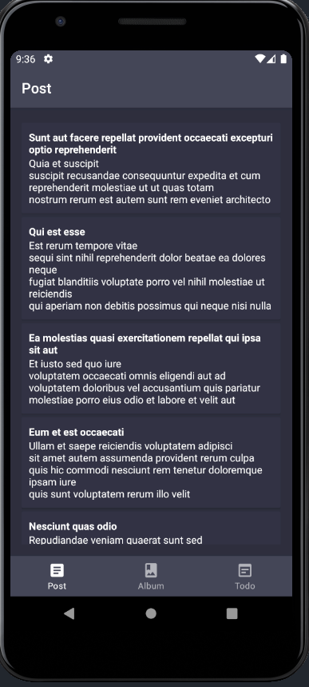

# framework-consume-api

Listagem de itens consumindo a api https://jsonplaceholder.typicode.com/.

## Características do projeto

* [Retrofit](https://square.github.io/retrofit/) -> Consumir API
* [Koin](https://insert-koin.io/) - Injeção de dependência
* [Coroutines](https://developer.android.com/kotlin/coroutines) -> Requisições assíncronas
* [Jetpack](https://developer.android.com/jetpack)
  * [Navigation](https://developer.android.com/topic/libraries/architecture/navigation/) -> Navegação
  * [LiveData](https://developer.android.com/topic/libraries/architecture/livedata) -> Armazenadora de dados observável
  * [Lifecycle](https://developer.android.com/topic/libraries/architecture/lifecycle) -> Ciclo de vida
  * [ViewModel](https://developer.android.com/topic/libraries/architecture/viewmodel) -> Encapsular dados
  * [Room](https://developer.android.com/jetpack/androidx/releases/room) -> Banco de dados
* Modern Architecture
  * [MVVM](https://developer.android.com/jetpack/guide) -> Arquitetura
  * Clean Architecture -> Boas práticas

